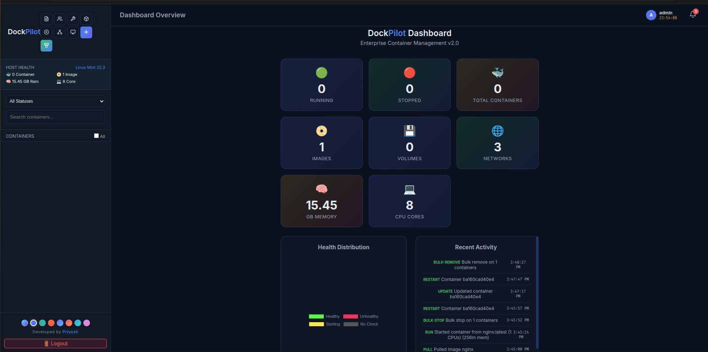

# 🐳 DockPilot — Enterprise Container Management Dashboard

A lightweight, real-time Docker management dashboard with a sleek dark UI. Monitor containers, stream logs, execute commands, build images, and manage volumes — all from your browser. 
Designed for single-node environments and local development orchestration.

<p align="center">
  
  
  
</p>



## ✨ Features

- **Docker Compose Orchestration** — Deploy multi-container stacks directly from YAML definitions
- **Real-time Log Streaming** — Live container logs with smart autoscrolling, filtering, and pause/resume
- **Interactive Terminal** — Execute commands inside running containers via browser-based terminal (Xterm.js)
- **Resource Constraints** — Fine-grained control over CPU (NanoCPUs) and Memory (Limits, Reservations, Swap)
- **Advanced Configuration** — Custom hostname overrides and Privileged mode support
- **Switchable Theme System** — 8+ premium UI themes for personalized orchestration
- **Container Lifecycle** — Start, stop, restart, clone, rename, snapshot, and remove containers
- **Image Management** — Build images from Dockerfiles, pull from Docker Hub, view layer history
- **Volume & Network Management** — Create, list, and delete Docker volumes and bridge networks
- **System Maintenance** — Prune unused containers, images, volumes, and networks with one click
- **Multi-User RBAC** — JWT authentication with Admin/Viewer roles, plus Admin password resets
- **Live Host Stats** — Real-time CPU & memory charts per container (Chart.js)
- **Bulk Operations** — Select multiple containers for batch start/stop/remove
- **Activity Audit Log** — Track all user actions for security compliance

## 🎨 Premium Themes

DockPilot now features a dynamic theme engine with 8+ built-in styles to match your workspace aesthetics:

- **Cyberpunk** — High-contrast neon cyan and purple
- **Midnight** — Deep blue and indigo core
- **Emerald** — Lush green and teal gradients
- **Sunset** — Vibrant orange and red hues
- **Aurora** — Mystical purple and cyan glow
- **Rosegold** — Elegant pink and amber tones
- **Ocean** — Serene sky blue and teal
- **Dracula** — Classic dark purple and pink palette

*Themes can be switched instantly from the dashboard footer.*

## 🚀 Quick Start (Docker - Recommended)

The easiest way to run DockPilot is using our official Docker image. 
Because DockPilot manages Docker itself, you **must** mount the Docker socket.

```bash
docker pull cerebro46/dockpilot:latest

docker run -d \
  -p 3000:3000 \
  -v /var/run/docker.sock:/var/run/docker.sock \
  --name dockpilot \
  cerebro46/dockpilot:latest
```

*Note: For Windows (WSL2) or macOS, the socket path is usually `//var/run/docker.sock:/var/run/docker.sock`.*

Access the dashboard at `http://localhost:3000`.

### Default Credentials
- **Username:** `admin`
- **Password:** `admin`
*(Note: Please change this immediately upon first login)*

## 🛠 Local Development Setup

If you prefer to run it without Docker or want to contribute:

```bash
# 1. Clone the repository
git clone https://github.com/priyesh2/Dockpilot.git
cd Dockpilot

# 2. Install dependencies
npm install

# 3. Start the server (Requires Docker running on the host system)
node server.js
```

## 🔒 Security Best Practices

Since DockPilot has root access to your Docker daemon, it is highly recommended to:
1. **Never** expose port 3000 directly to the public internet without a reverse proxy (like Nginx or Traefik).
2. Set up HTTPS/SSL termination at the proxy level.
3. Change default admin credentials immediately.
4. Mount behind a VPN or internal network if deployed in production.

## 📦 Tech Stack

| Component | Technology |
|-----------|-----------|
| **Backend** | Node.js, Express, Socket.io |
| **Frontend** | Vanilla JS, CSS3, Xterm.js (Terminal), Chart.js (Graphs) |
| **Docker API** | Dockerode (Node.js wrapper for Docker Engine API) |
| **Security** | JWT Tokens, Role-Based Access Control, SHA-256 Hashing |

## 👨‍💻 Contributing

Pull requests are welcome. For major changes, please open an issue first to discuss what you would like to change.

## 📄 License

This project is licensed under the MIT License.
